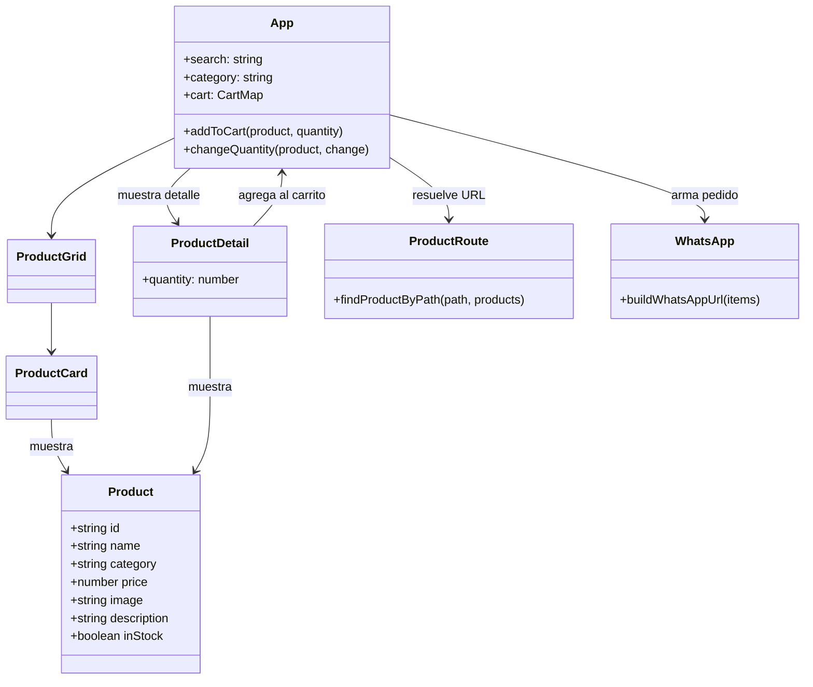
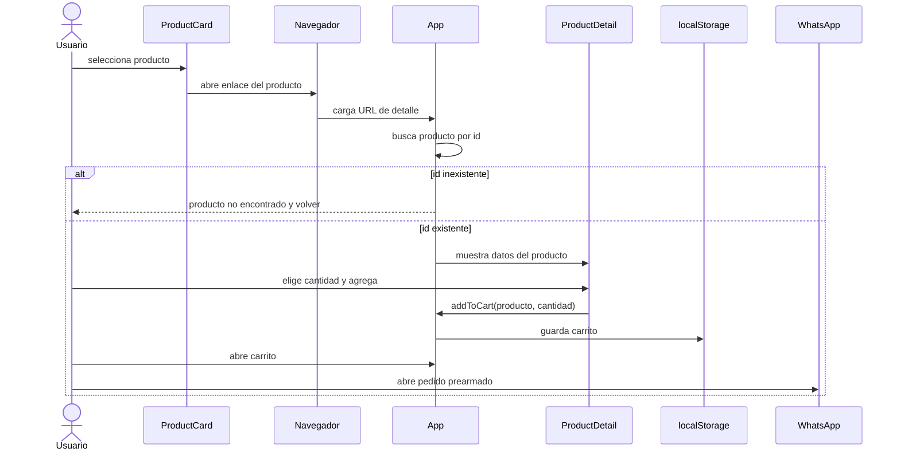

# UML - Página de producto

Al seleccionar un producto, el navegador abre una URL `/producto/:id`. La tienda usa enlaces normales y resuelve la ruta en `App`, sin librería de router. El carrito persiste en `localStorage`.

## Componentes y datos

## Secuencia de compra

Para un despliegue público, el servidor debe devolver `index.html` cuando se accede directamente a una URL de producto; Vite ya lo hace en desarrollo.
